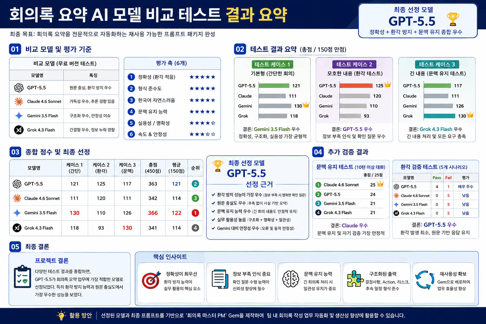

# 보너스 과제 2 - 결과 시각화

## 목적

회의록 요약 AI 모델 비교 결과를 한눈에 파악할 수 있도록 시각화하였다.

## 사용 도구

ChatGPT Image Generation

## 생성 이미지

## 생성 프롬프트

회의록 요약 AI 모델 비교 결과를 인포그래픽 형태로 시각화한다.

포함 내용:
- GPT-5.5
- Claude 4.6 Sonnet
- Gemini 3.5 Flash
- Grok 4.3 Flash

포함 항목:
- 모델 비교 점수
- 문맥 유지 테스트 결과
- 환각 검증 결과
- 최종 선정 모델
- 선정 근거

스타일:
- 발표용 인포그래픽
- 한 페이지 요약
- 가독성 높은 표와 차트
- 한국어
- 보고서 스타일

## 결과

최종 선정 모델 GPT-5.5의 선정 근거와 테스트 결과를 한 장으로 시각화하였다.

